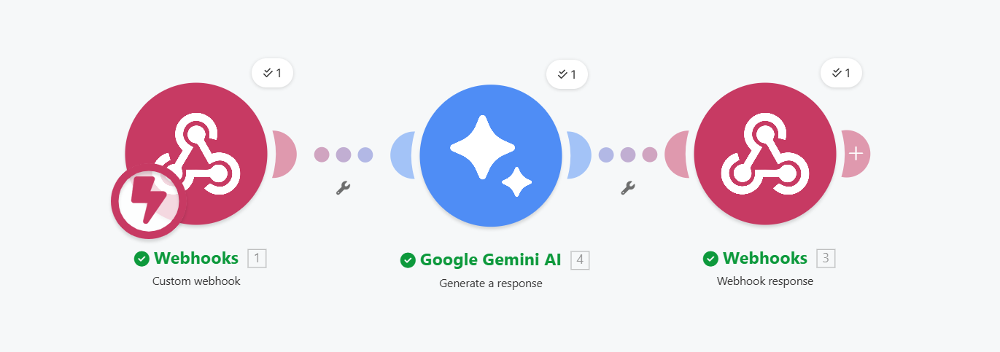

# 🚀 Offiwiz — De Datos Crudos a Decisiones Ejecutivas

**Offiwiz** es una landing page moderna y minimalista diseñada para promocionar una herramienta de IA que convierte archivos CSV en informes ejecutivos estratégicos de forma instantánea.


## ✨ Características

- **Análisis con IA**: Interfaz intuitiva para subir archivos CSV y recibir un análisis profundo en segundos.
- **Diseño Premium**: Estética tecnológica limpia con gradientes, efectos de glassmorphism y animaciones fluidas.
- **Totalmente Responsive**: Optimizado para dispositivos móviles, tablets y ordenadores de sobremesa.
- **Experiencia de Usuario (UX)**: Soporte para Drag & Drop, indicadores de carga y feedback visual inmediato.
- **Optimizado para Conversión**: Secciones de "Cómo Funciona" y "Beneficios" diseñadas para guiar al usuario.

## 🛠️ Tecnologías Utilizadas

- **HTML5**: Estructura semántica y SEO-friendly.
- **CSS3 (Vanilla)**: Sistema de diseño personalizado con variables CSS y animaciones `@keyframes`.
- **JavaScript (ES6+)**: Lógica de interceptación de formularios, gestión de `FormData` y peticiones asíncronas vía `fetch`.
- **Google Fonts**: Tipografía 'Inter' para una legibilidad máxima.

## 🚀 Instalación y Uso

1. **Clona el repositorio:**
   ```bash
   git clone https://github.com/Ikernom/offiwiz-landing-csv.git
   ```

2. **Configura tu Webhook:**
   Abre `script.js` y localiza la constante `TU_WEBHOOK_URL` para añadir tu endpoint de procesamiento (ej. Make, Zapier o un backend propio):
   ```javascript
   const TU_WEBHOOK_URL = 'TU_URL_AQUI';
   ```

   **Ejemplo de Workflow (Make.com):**
   


3. **¡Listo para usar!**
   Abre `index.html` en cualquier navegador moderno.

## 📈 Estructura del Proyecto

```text
├── index.html    # Estructura principal de la landing page
├── style.css     # Estilos, diseño y animaciones
├── script.js    # Lógica de carga de archivos y comunicación con IA
└── README.md     # Documentación del proyecto
```

---

Desarrollado con ❤️ para **Offiwiz** — 2026.
